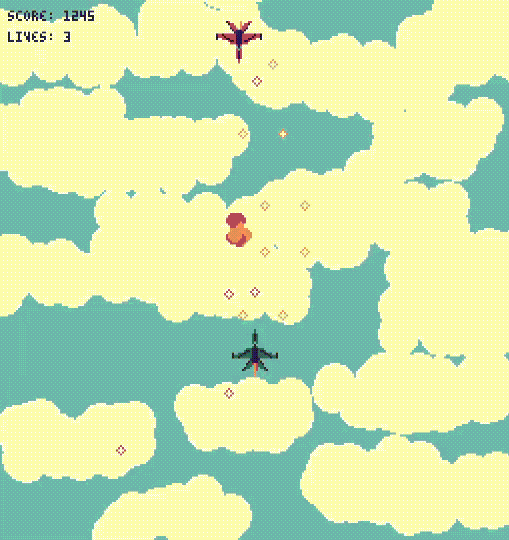

# Sky Combat
Sky Combat - Sample game of [Flask game framework](https://github.com/aegis-dev/flask)

This game aims to demonstrate capabilities of the Flask game framework.



## Build
```
wasm-pack build --target web
```

## Run
To run game you need to serve built files with any static file server.
Here is an example one:
```
# In project root directory
python -m http.server^C
```
